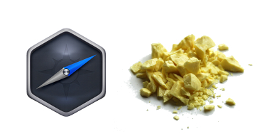

# NW SULFUR is a way to package your node webkit program
[](./nw-sulfur-ui/other/sulfur_nwlabel.jpg)
## Why ?
### Before nw sulfur:
  Your nw folder with binaries is around **150M+**
### After nw-sulfur:
  Your nw-folder is around **20M**
## Installation:

* Put appropriate binary in your **NW folder**(where package json resides). Put also ui folder there. 
* Put these into your package json:
```json
  "sulfur-url":{
    "win32":"http://dl.nwjs.io/v0.11.0/node-webkit-v0.11.0-win-ia32.zip",
    "win64":"http://dl.nwjs.io/v0.11.0/node-webkit-v0.11.0-win-x64.zip",
    "lin32":"http://dl.nwjs.io/v0.11.0/node-webkit-v0.11.0-linux-ia32.tar.gz",
    "lin64":"http://dl.nwjs.io/v0.11.0/node-webkit-v0.11.0-linux-x64.tar.gz"
  }
```
* ...
* PROFIT

## What exactly does it do.
1. Determines if you have to download NW.js
2. If Yes: Downloads it and Shows fancy progressbar.
3. If No:  Opens your app with NW binary.

## If You want custom progressbar:
Go to ui folder, and hack around. It is a simple html page with css.
But keep in mind, that it opens on user default browser(it can be IE6)

### The more people package apps with nw-sulfur. The less users will have to download it

## TODO

* Make support for **OSX**
* Make support for Archived NW package

Links:

  * [win32](https://github.com/VbifRkbvjd/nw-sulfur/releases/download/alpha/nw-sulfur-windows-386.exe)
  * [win64](https://github.com/VbifRkbvjd/nw-sulfur/releases/download/alpha/nw-sulfur-windows-amd64.exe)
  * [lin32](https://github.com/VbifRkbvjd/nw-sulfur/releases/download/alpha/nw-sulfur-linux-386)
  * [lin64](https://github.com/VbifRkbvjd/nw-sulfur/releases/download/alpha/nw-sulfur-linux-amd64)


